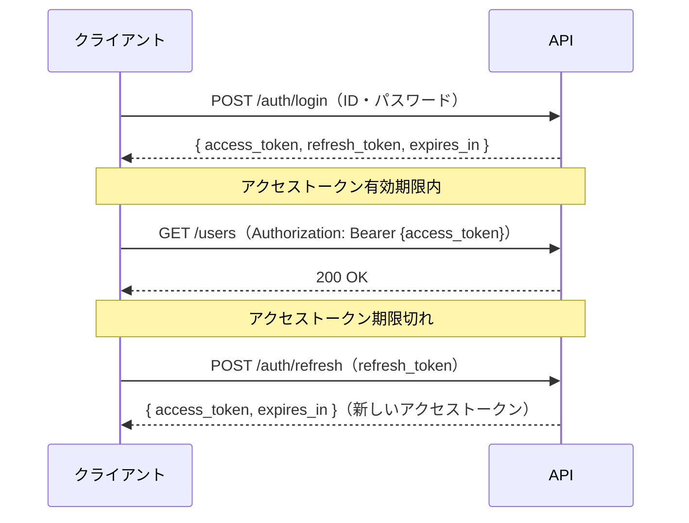

# API仕様書

| 項目 | 内容 |
|------|------|
| プロジェクト名 | |
| ベースURL | `https://example.com/api/v1` |
| 認証方式 | Bearer Token（JWT） |
| 作成日 | |
| 作成者 | |
| 承認者 | |

---

## 1. 共通仕様

### リクエストヘッダー

| ヘッダー | 必須 | 値 |
|---------|------|-----|
| Content-Type | 必須 | `application/json` |
| Authorization | 必須 | `Bearer {token}` |

### レスポンス形式

```json
{
  "success": true,
  "data": {},
  "error": null,
  "meta": {
    "total": 100,
    "page": 1,
    "limit": 20
  }
}
```

### エラーコード一覧

| コード | HTTPステータス | 説明 |
|--------|--------------|------|
| 400 | Bad Request | リクエストパラメータ不正 |
| 401 | Unauthorized | 認証エラー |
| 403 | Forbidden | 権限なし |
| 404 | Not Found | リソースが存在しない |
| 429 | Too Many Requests | レート制限超過 |
| 500 | Internal Server Error | サーバーエラー |

### レート制限

| エンドポイント種別 | 制限 | 超過時のレスポンス |
|----------------|------|----------------|
| 一般API | 100リクエスト / 分 / ユーザー | 429 + `Retry-After` ヘッダー |
| 認証API（ログイン） | 10リクエスト / 分 / IP | 429 + ロック解除時刻 |
| ファイルアップロード | 10リクエスト / 分 / ユーザー | 429 |

---

## 2. 認証フロー

### トークン取得・更新フロー



| トークン種別 | 有効期限 | 用途 |
|------------|---------|------|
| access_token | 15分 | API認証 |
| refresh_token | 30日 | access_token更新 |

---

## 3. エンドポイント一覧

| No | メソッド | パス | 説明 | 認証 |
|----|---------|------|------|------|
| 1 | POST | `/auth/login` | ログイン | 不要 |
| 2 | POST | `/auth/refresh` | トークン更新 | 不要 |
| 3 | GET | `/users` | ユーザー一覧取得 | 必須 |
| 4 | GET | `/users/:id` | ユーザー詳細取得 | 必須 |
| 5 | POST | `/users` | ユーザー作成 | 必須 |
| 6 | PUT | `/users/:id` | ユーザー更新 | 必須 |
| 7 | DELETE | `/users/:id` | ユーザー削除 | 必須 |

---

## 4. エンドポイント詳細

### GET `/users` - ユーザー一覧取得

**クエリパラメータ**

| パラメータ | 型 | 必須 | 説明 |
|-----------|-----|------|------|
| name | string | 任意 | 名前で部分一致検索 |
| page | int | 任意 | ページ番号（デフォルト：1） |
| limit | int | 任意 | 件数（デフォルト：20） |

**レスポンス例（200 OK）**

```json
{
  "success": true,
  "data": [
    {
      "id": 1,
      "name": "山田太郎",
      "email": "yamada@example.com",
      "created_at": "2024-01-01T00:00:00Z"
    }
  ],
  "meta": {
    "total": 100,
    "page": 1,
    "limit": 20
  }
}
```

---

### POST `/users` - ユーザー作成

**リクエストボディ**

```json
{
  "name": "山田太郎",
  "email": "yamada@example.com",
  "password": "password123"
}
```

**バリデーション**

| フィールド | 必須 | ルール |
|-----------|------|--------|
| name | 必須 | 100文字以内 |
| email | 必須 | メール形式・重複不可 |
| password | 必須 | 8文字以上 |

**レスポンス例（201 Created）**

```json
{
  "success": true,
  "data": {
    "id": 1,
    "name": "山田太郎",
    "email": "yamada@example.com"
  }
}
```

---

## 承認

| 役割 | 氏名 | 署名 | 日付 |
|------|------|------|------|
| プロジェクトオーナー | | | |
| 開発リード | | | |

---

## ドキュメント更新履歴

| バージョン | 日付 | 更新者 | 内容 |
|-----------|------|--------|------|
| 1.0 | | | 初版作成 |
