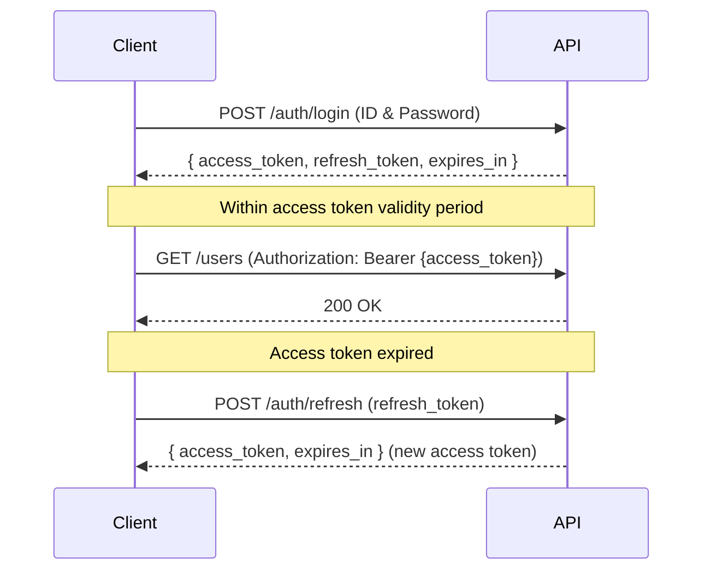

# API Specification

| Item | Content |
|------|---------|
| Project Name | |
| Base URL | `https://example.com/api/v1` |
| Authentication | Bearer Token (JWT) |
| Created Date | |
| Author | |
| Approver | |

---

## 1. Common Specifications

### Request Headers

| Header | Required | Value |
|--------|---------|-------|
| Content-Type | Required | `application/json` |
| Authorization | Required | `Bearer {token}` |

### Response Format

```json
{
  "success": true,
  "data": {},
  "error": null,
  "meta": {
    "total": 100,
    "page": 1,
    "limit": 20
  }
}
```

### Error Code List

| Code | HTTP Status | Description |
|------|------------|------------|
| 400 | Bad Request | Invalid request parameters |
| 401 | Unauthorized | Authentication error |
| 403 | Forbidden | Insufficient permissions |
| 404 | Not Found | Resource does not exist |
| 429 | Too Many Requests | Rate limit exceeded |
| 500 | Internal Server Error | Server error |

### Rate Limits

| Endpoint Type | Limit | Response on Exceeded |
|--------------|-------|---------------------|
| General API | 100 requests / min / user | 429 + `Retry-After` header |
| Auth API (Login) | 10 requests / min / IP | 429 + unlock time |
| File Upload | 10 requests / min / user | 429 |

---

## 2. Authentication Flow

### Token Acquisition & Refresh Flow



| Token Type | Expiry | Purpose |
|-----------|--------|---------|
| access_token | 15 min | API authentication |
| refresh_token | 30 days | access_token renewal |

---

## 3. Endpoint List

| No | Method | Path | Description | Auth |
|----|--------|------|-------------|------|
| 1 | POST | `/auth/login` | Login | Not required |
| 2 | POST | `/auth/refresh` | Token refresh | Not required |
| 3 | GET | `/users` | Get user list | Required |
| 4 | GET | `/users/:id` | Get user details | Required |
| 5 | POST | `/users` | Create user | Required |
| 6 | PUT | `/users/:id` | Update user | Required |
| 7 | DELETE | `/users/:id` | Delete user | Required |

---

## 4. Endpoint Details

### GET `/users` - Get User List

**Query Parameters**

| Parameter | Type | Required | Description |
|----------|------|---------|------------|
| name | string | Optional | Partial match search by name |
| page | int | Optional | Page number (default: 1) |
| limit | int | Optional | Records per page (default: 20) |

**Response Example (200 OK)**

```json
{
  "success": true,
  "data": [
    {
      "id": 1,
      "name": "Yamada Taro",
      "email": "yamada@example.com",
      "created_at": "2024-01-01T00:00:00Z"
    }
  ],
  "meta": {
    "total": 100,
    "page": 1,
    "limit": 20
  }
}
```

---

### POST `/users` - Create User

**Request Body**

```json
{
  "name": "Yamada Taro",
  "email": "yamada@example.com",
  "password": "password123"
}
```

**Validation**

| Field | Required | Rules |
|-------|---------|-------|
| name | Required | Max 100 characters |
| email | Required | Email format · No duplicates |
| password | Required | 8 characters or more |

**Response Example (201 Created)**

```json
{
  "success": true,
  "data": {
    "id": 1,
    "name": "Yamada Taro",
    "email": "yamada@example.com"
  }
}
```

---

## Approval

| Role | Name | Signature | Date |
|------|------|-----------|------|
| Project Owner | | | |
| Development Lead | | | |

---

## Document History

| Version | Date | Author | Content |
|---------|------|--------|---------|
| 1.0 | | | Initial version |
