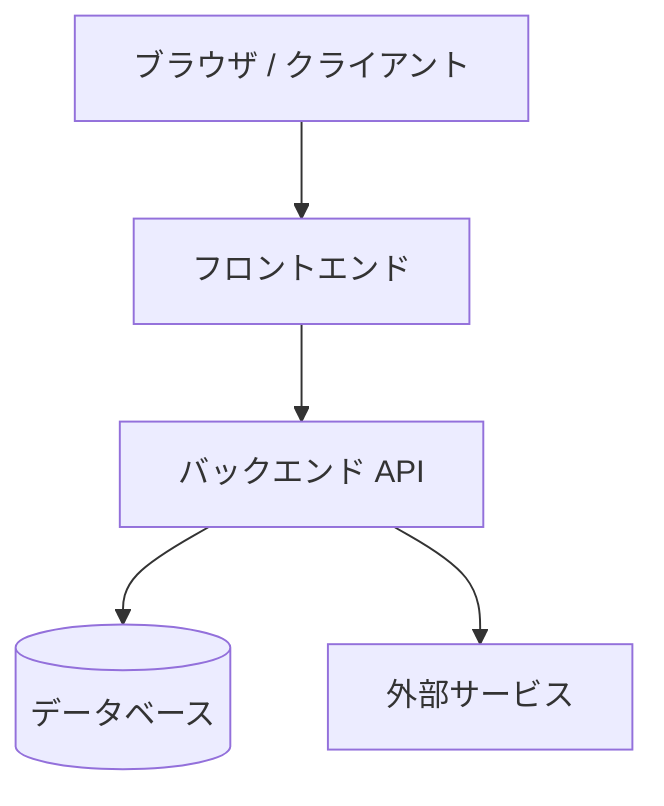
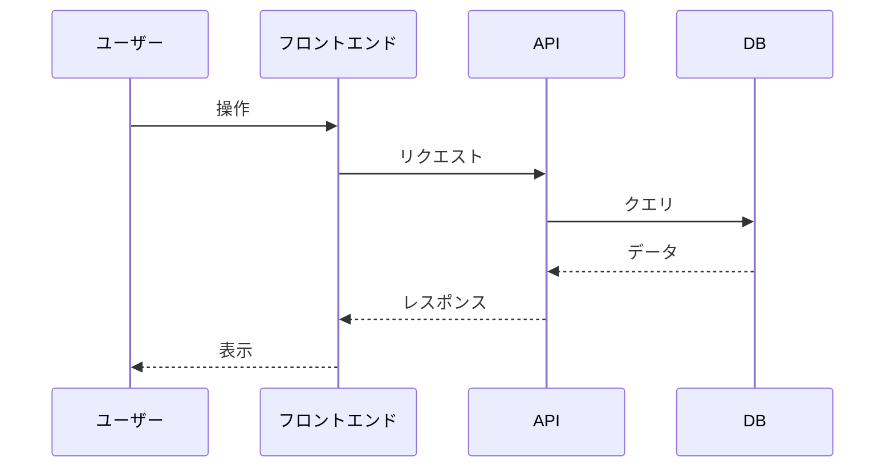
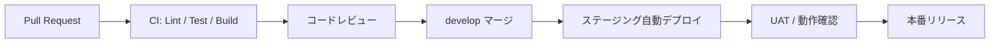

# Software Architecture Document

| 項目 | 内容 |
|------|------|
| プロジェクト名 | |
| バージョン | |
| 作成日 | |
| 作成者 | |
| 承認者 | |

---

## 1. システム概要

<!-- システム全体の目的と構成を簡潔に説明 -->

## 2. 技術スタック

| レイヤー | 技術 | バージョン | 選定理由 |
|---------|------|-----------|---------|
| フロントエンド | | | |
| バックエンド | | | |
| データベース | | | |
| インフラ | | | |
| 認証 | | | |

## 3. システム構成図

## 4. 環境構成

| 環境 | 用途 | URL / ホスト |
|------|------|-------------|
| 本番（Production） | | |
| ステージング（Staging） | | |
| 開発（Development） | | |

## 5. データフロー

## 6. セキュリティ設計

- 認証方式:
- 認可方式:
- 通信暗号化:
- データ暗号化:

## 7. CI/CD 設計

| ステージ | ツール | 内容 |
|---------|--------|------|
| Lint / 静的解析 | ESLint / tsc | コード品質チェック |
| 単体テスト | Jest | カバレッジ 80% 以上 |
| E2E テスト | Playwright | 主要フローの自動テスト |
| ビルド | Vite / Next.js | 本番ビルドの成功確認 |
| デプロイ（Staging） | GitHub Actions | develop マージ時に自動実行 |
| デプロイ（Production） | GitHub Actions | main マージ時に手動承認後実行 |

## 8. ロギング・監視設計

| 項目 | 内容 |
|------|------|
| アプリケーションログ | （例）Cloud Logging / CloudWatch |
| エラー監視 | （例）Sentry |
| パフォーマンス監視 | （例）Datadog APM |
| アップタイム監視 | （例）UptimeRobot |
| アラート通知先 | （例）Slack #alerts チャンネル |

### ログレベル定義

| レベル | 用途 |
|-------|------|
| ERROR | システムエラー・例外（必ずアラート通知） |
| WARN | 想定外の動作・リトライ発生 |
| INFO | 主要な業務イベント（ログイン・登録・決済など） |
| DEBUG | 開発時デバッグ情報（本番では出力しない） |

## 9. キャッシュ戦略

| 対象 | キャッシュ方式 | TTL | 無効化タイミング |
|------|-------------|-----|---------------|
| （例）ユーザー情報 | Redis | 15分 | ログアウト・プロフィール更新時 |
| （例）マスタデータ | Redis | 1時間 | 管理者が更新時 |
| （例）静的アセット | CDN | 1年（ハッシュ付きファイル名） | デプロイ時 |

---

## 承認

| 役割 | 氏名 | 署名 | 日付 |
|------|------|------|------|
| プロジェクトオーナー | | | |
| 開発リード | | | |

---

## ドキュメント更新履歴

| バージョン | 日付 | 更新者 | 内容 |
|-----------|------|--------|------|
| 1.0 | | | 初版作成 |
