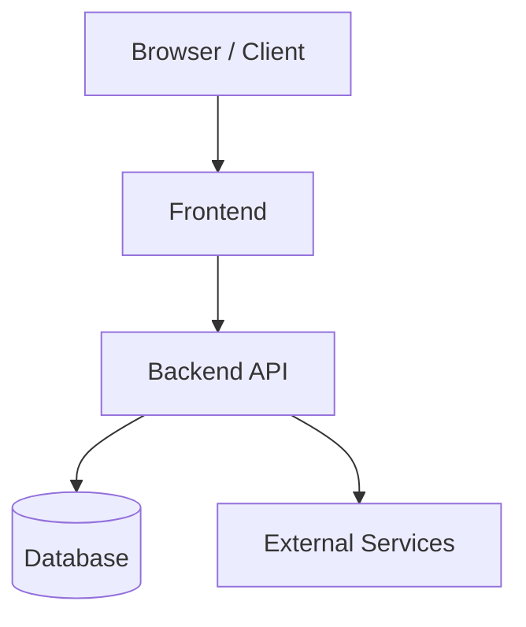
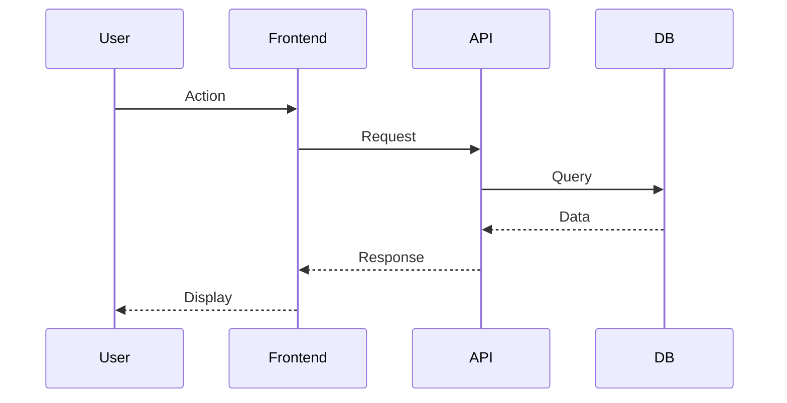
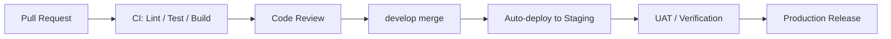

# Software Architecture Document

| Item | Content |
|------|---------|
| Project Name | |
| Version | |
| Created Date | |
| Author | |
| Approver | |

---

## 1. System Overview

<!-- Briefly describe the overall purpose and structure of the system -->

## 2. Technology Stack

| Layer | Technology | Version | Selection Rationale |
|-------|-----------|---------|---------------------|
| Frontend | | | |
| Backend | | | |
| Database | | | |
| Infrastructure | | | |
| Authentication | | | |

## 3. System Architecture Diagram

## 4. Environment Configuration

| Environment | Purpose | URL / Host |
|------------|---------|-----------|
| Production | | |
| Staging | | |
| Development | | |

## 5. Data Flow

## 6. Security Design

- Authentication method:
- Authorization method:
- Communication encryption:
- Data encryption:

## 7. CI/CD Design

| Stage | Tool | Content |
|-------|------|---------|
| Lint / Static Analysis | ESLint / tsc | Code quality check |
| Unit Tests | Jest | Coverage 80% or above |
| E2E Tests | Playwright | Automated testing of main flows |
| Build | Vite / Next.js | Verify production build succeeds |
| Deploy (Staging) | GitHub Actions | Auto-run on develop merge |
| Deploy (Production) | GitHub Actions | Run after manual approval on main merge |

## 8. Logging & Monitoring Design

| Item | Content |
|------|---------|
| Application Logs | (e.g.) Cloud Logging / CloudWatch |
| Error Monitoring | (e.g.) Sentry |
| Performance Monitoring | (e.g.) Datadog APM |
| Uptime Monitoring | (e.g.) UptimeRobot |
| Alert Notification | (e.g.) Slack #alerts channel |

### Log Level Definitions

| Level | Purpose |
|-------|---------|
| ERROR | System errors / exceptions (always send alert notification) |
| WARN | Unexpected behavior / retries occurring |
| INFO | Key business events (login, registration, payment, etc.) |
| DEBUG | Development debug info (not output in production) |

## 9. Cache Strategy

| Target | Cache Method | TTL | Invalidation Timing |
|--------|------------|-----|---------------------|
| (e.g.) User information | Redis | 15 min | On logout / profile update |
| (e.g.) Master data | Redis | 1 hour | When admin updates |
| (e.g.) Static assets | CDN | 1 year (hashed filename) | On deployment |

---

## 10. BMAD Architect Checklist

> Complete this checklist after drafting the architecture and before stories are written.
> The Architect persona uses this to ensure cross-cutting concerns are resolved before
> the Developer persona starts implementing.

### Cross-Cutting Concerns
- [ ] Authentication strategy defined (JWT / session / OAuth provider)
- [ ] Authorization model defined (RBAC / ABAC / row-level security)
- [ ] API error response format standardized
- [ ] Logging format standardized (structured JSON, required fields defined)
- [ ] Secrets management approach defined (env vars, vault, KMS)
- [ ] Rate limiting approach defined for all public endpoints
- [ ] CORS policy defined
- [ ] Data validation layer defined (where validation happens: client / API / both)

### Performance & Scalability
- [ ] Database indexing strategy defined for anticipated query patterns
- [ ] Pagination strategy defined (cursor / offset / keyset)
- [ ] Caching layers identified (CDN, in-memory, DB query cache)
- [ ] Async processing approach defined for long-running operations
- [ ] File upload strategy defined (if applicable)

### Testing Strategy
- [ ] Test database strategy defined (separate DB / transactions / mocks)
- [ ] Integration test approach defined (test containers / Docker / seeded fixtures)
- [ ] E2E test scope defined (critical paths covered in Playwright)
- [ ] Performance test thresholds defined (p95 latency, max concurrent users)

### Developer Experience
- [ ] Local development setup documented (`README.md` or `CLAUDE.md`)
- [ ] Environment variable list complete (`.env.example` up to date)
- [ ] Code generation / scaffolding patterns defined for repetitive structures
- [ ] PR / branching strategy defined for this project

---

## 11. Architecture Decision Log

> Record key architectural decisions that are not obvious from reading the code.
> Add one row per decision. Full ADRs are optional — the row captures enough context
> for future developers to understand WHY without digging through commit history.

| ID | Decision | Alternatives Considered | Rationale | Date | Status |
|----|----------|------------------------|-----------|------|--------|
| AD-01 | | | | | Active / Superseded |
| AD-02 | | | | | Active / Superseded |

---

## Approval

| Role | Name | Signature | Date |
|------|------|-----------|------|
| Project Owner | | | |
| Development Lead | | | |

---

## Document History

| Version | Date | Author | Content |
|---------|------|--------|---------|
| 1.0 | | | Initial version |
