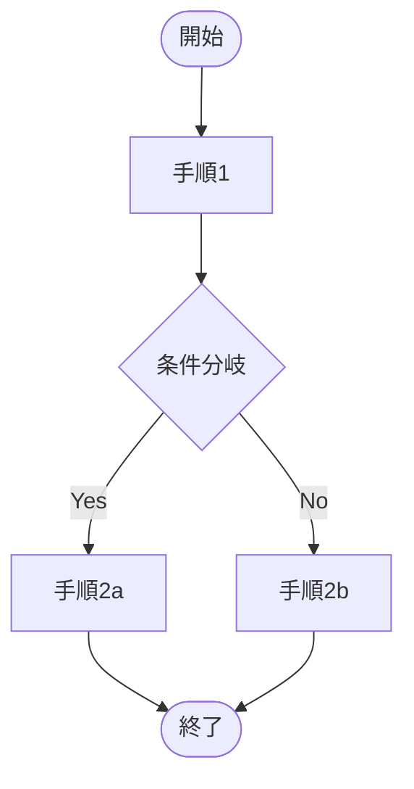
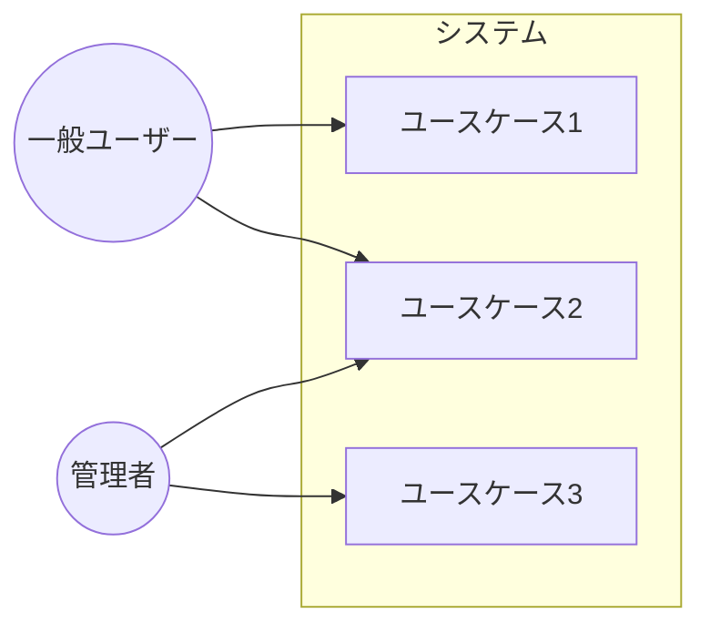

# 業務フロー図

| 項目 | 内容 |
|------|------|
| プロジェクト名 | |
| 対象業務 | |
| 作成日 | |
| 作成者 | |

---

## As-Is（現状の業務フロー）

### 現状の課題

| No | 課題 | 影響 |
|----|------|------|
| 1 | | |
| 2 | | |

---

## To-Be（将来の業務フロー）

### 改善ポイント

| No | 改善内容 | 期待効果 |
|----|---------|---------|
| 1 | | |
| 2 | | |

---

## 登場人物（アクター）

| アクター | 役割 |
|---------|------|
| | |

---

## ユースケース図

<!-- アクターとシステム機能の関係を図示する。詳細な機能一覧はSRS 1.1・ユースケース記述はSRS 1.2を参照 -->

| ユースケース | 説明 | 対象アクター |
|------------|------|------------|
| ユースケース1 | | 一般ユーザー |
| ユースケース2 | | 一般ユーザー・管理者 |
| ユースケース3 | | 管理者 |
