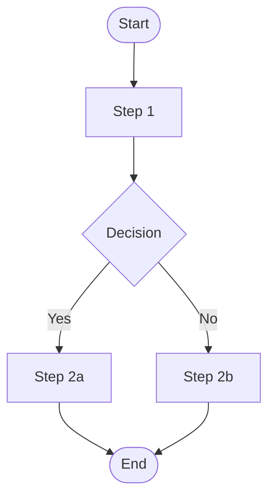
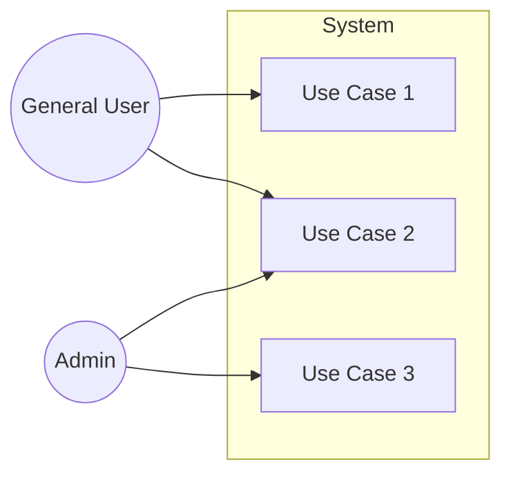

# Business Flow Diagram

| Item | Content |
|------|---------|
| Project Name | |
| Target Process | |
| Created Date | |
| Author | |

---

## As-Is (Current Business Flow)

### Current Issues

| No | Issue | Impact |
|----|-------|--------|
| 1 | | |
| 2 | | |

---

## To-Be (Future Business Flow)

### Improvement Points

| No | Improvement | Expected Effect |
|----|------------|----------------|
| 1 | | |
| 2 | | |

---

## Actors

| Actor | Role |
|-------|------|
| | |

---

## Use Case Diagram

<!-- Illustrate the relationship between actors and system features. For detailed feature list, see SRS 1.1; for use case descriptions, see SRS 1.2 -->

| Use Case | Description | Target Actor |
|---------|------------|-------------|
| Use Case 1 | | General User |
| Use Case 2 | | General User · Admin |
| Use Case 3 | | Admin |
