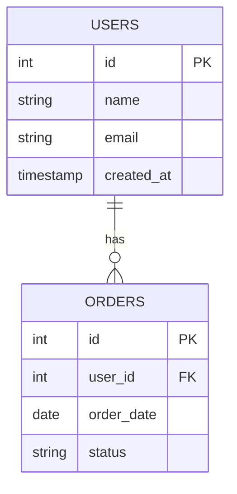

# DB設計書（ER図・テーブル定義）

| 項目 | 内容 |
|------|------|
| プロジェクト名 | |
| データベース | |
| 作成日 | |
| 作成者 | |
| 承認者 | |

---

## 1. ER図

---

## 2. テーブル定義

### テーブル名：`users`

| カラム名 | 型 | 制約 | デフォルト | 説明 |
|---------|-----|------|-----------|------|
| id | INT | PK, AUTO_INCREMENT | | ユーザーID |
| name | VARCHAR(100) | NOT NULL | | 氏名 |
| email | VARCHAR(255) | NOT NULL, UNIQUE | | メールアドレス |
| created_at | TIMESTAMP | NOT NULL | CURRENT_TIMESTAMP | 作成日時 |
| updated_at | TIMESTAMP | NOT NULL | CURRENT_TIMESTAMP | 更新日時 |

### テーブル名：`（テーブル名）`

| カラム名 | 型 | 制約 | デフォルト | 説明 |
|---------|-----|------|-----------|------|
| id | INT | PK, AUTO_INCREMENT | | |
| | | | | |

---

## 3. 外部キー制約一覧

| 制約名 | 子テーブル | 子カラム | 親テーブル | 親カラム | ON DELETE | ON UPDATE |
|--------|-----------|---------|-----------|---------|-----------|-----------|
| fk_orders_user_id | orders | user_id | users | id | RESTRICT | CASCADE |
| | | | | | | |

---

## 4. インデックス定義

| テーブル名 | インデックス名 | カラム | 種別 | 目的 |
|-----------|-------------|--------|------|------|
| | | | UNIQUE / INDEX | |

---

## 5. 命名規則

- テーブル名：スネークケース・複数形（例：`users`, `order_items`）
- カラム名：スネークケース（例：`created_at`, `user_id`）
- 外部キー：`参照テーブル名_id`（例：`user_id`）
- 制約名：`fk_<子テーブル>_<カラム名>`（例：`fk_orders_user_id`）

---

## 承認

| 役割 | 氏名 | 署名 | 日付 |
|------|------|------|------|
| プロジェクトオーナー | | | |
| 開発リード | | | |

---

## ドキュメント更新履歴

| バージョン | 日付 | 更新者 | 内容 |
|-----------|------|--------|------|
| 1.0 | | | 初版作成 |
