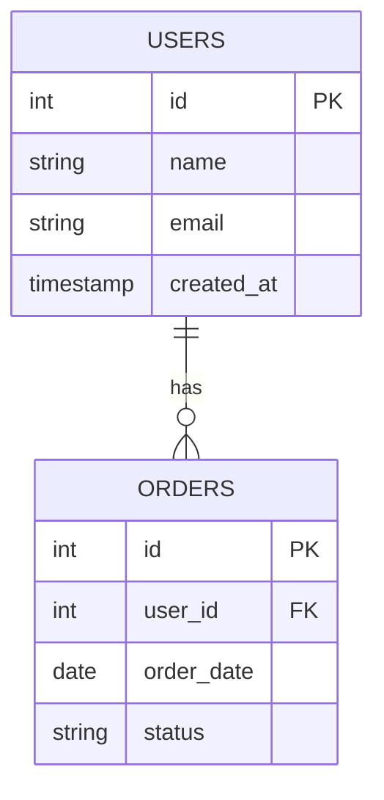

# DB Design Document (ER Diagram & Table Definitions)

| Item | Content |
|------|---------|
| Project Name | |
| Database | |
| Created Date | |
| Author | |
| Approver | |

---

## 1. ER Diagram

---

## 2. Table Definitions

### Table: `users`

| Column Name | Type | Constraints | Default | Description |
|------------|------|------------|---------|------------|
| id | INT | PK, AUTO_INCREMENT | | User ID |
| name | VARCHAR(100) | NOT NULL | | Full name |
| email | VARCHAR(255) | NOT NULL, UNIQUE | | Email address |
| created_at | TIMESTAMP | NOT NULL | CURRENT_TIMESTAMP | Created timestamp |
| updated_at | TIMESTAMP | NOT NULL | CURRENT_TIMESTAMP | Updated timestamp |

### Table: `(table name)`

| Column Name | Type | Constraints | Default | Description |
|------------|------|------------|---------|------------|
| id | INT | PK, AUTO_INCREMENT | | |
| | | | | |

---

## 3. Foreign Key Constraints

| Constraint Name | Child Table | Child Column | Parent Table | Parent Column | ON DELETE | ON UPDATE |
|----------------|------------|-------------|-------------|--------------|-----------|-----------|
| fk_orders_user_id | orders | user_id | users | id | RESTRICT | CASCADE |
| | | | | | | |

---

## 4. Index Definitions

| Table Name | Index Name | Column | Type | Purpose |
|-----------|-----------|--------|------|---------|
| | | | UNIQUE / INDEX | |

---

## 5. Naming Conventions

- Table names: snake_case, plural form (e.g., `users`, `order_items`)
- Column names: snake_case (e.g., `created_at`, `user_id`)
- Foreign keys: `referenced_table_id` (e.g., `user_id`)
- Constraint names: `fk_<child_table>_<column_name>` (e.g., `fk_orders_user_id`)

---

## Approval

| Role | Name | Signature | Date |
|------|------|-----------|------|
| Project Owner | | | |
| Development Lead | | | |

---

## Document History

| Version | Date | Author | Content |
|---------|------|--------|---------|
| 1.0 | | | Initial version |
