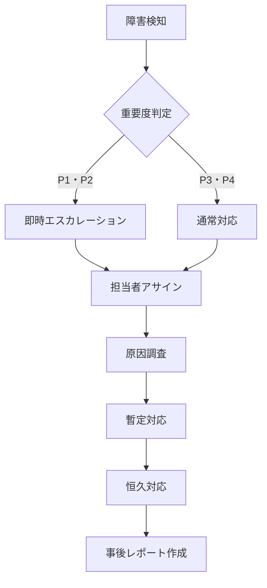

# 運用要件定義書

| 項目 | 内容 |
|------|------|
| プロジェクト名 | |
| 作成日 | |
| 作成者 | |

---

## 1. 教育・トレーニング

### 1.1 対象者と研修計画

| 対象者 | 研修内容 | 実施方法 | 実施時期 | 担当 |
|--------|---------|---------|---------|------|
| エンドユーザー | システム基本操作 | 集合研修 / マニュアル配布 | リリース前 | |
| 管理者 | 管理機能・権限管理 | 個別研修 | リリース前 | |
| 運用担当者 | 運用手順・障害対応 | OJT | リリース前〜後 | |

### 1.2 研修資料

| 資料名 | 対象者 | 保管場所 |
|--------|--------|---------|
| ユーザーマニュアル | エンドユーザー | |
| 管理者マニュアル | 管理者 | |
| 運用手順書 | 運用担当者 | |

---

## 2. 運用体制

### 2.1 運用体制図

<!-- 運用担当者・連絡系統を記載 -->

| 役割 | 担当者 | 連絡先 | 対応時間 |
|------|--------|--------|---------|
| 運用管理者 | | | |
| ユーザーサポート | | | |
| インフラ担当 | | | |
| 開発担当（障害時） | | | |

### 2.2 運用時間

| 項目 | 内容 |
|------|------|
| システム稼働時間 | 平日 9:00〜18:00 / 24時間365日 |
| サポート受付時間 | |
| 計画停止ウィンドウ | |

### 2.3 監視・アラート

| 監視項目 | 監視方法 | アラート条件 | 通知先 |
|---------|---------|------------|--------|
| サーバー死活監視 | | | |
| レスポンスタイム | | 〇秒超過 | |
| エラーログ | | | |
| ディスク使用率 | | 80% 超過 | |

### 2.4 バックアップ

| 対象 | バックアップ方式 | 頻度 | 保持期間 | 保管場所 |
|------|---------------|------|---------|---------|
| データベース | フルバックアップ | 日次 | 30日 | |
| ファイルストレージ | | | | |
| ログ | | | | |

### 2.5 定期作業

| 作業内容 | 頻度 | 担当 | 手順書 |
|---------|------|------|--------|
| バックアップ確認 | 週次 | | |
| ログローテーション | 月次 | | |
| セキュリティパッチ適用 | 月次 / 随時 | | |
| パフォーマンス確認 | 月次 | | |

---

## 3. 保守

### 3.1 保守範囲

| 保守区分 | 内容 | 対応者 |
|---------|------|--------|
| 障害対応保守 | バグ修正・緊急対応 | |
| 予防保守 | バージョンアップ・パッチ適用 | |
| 適応保守 | OS・ミドルウェアの変更対応 | |
| 完全化保守 | 機能改善・追加 | |

### 3.2 SLA（サービスレベル）

| 項目 | 目標値 |
|------|--------|
| システム稼働率 | 99.9% |
| 障害検知から連絡までの時間 | 〇時間以内 |
| 障害復旧目標時間（RTO） | |
| 障害復旧目標時点（RPO） | |
| P1（最重要）障害対応開始 | 〇時間以内 |

### 3.3 障害対応フロー

### 3.4 変更管理

| 項目 | 手順 |
|------|------|
| 変更申請 | 担当者が変更申請票を起票 |
| 影響評価 | 開発担当・運用担当でレビュー |
| 承認 | 管理者承認後に作業実施 |
| 実施・確認 | 作業後に動作確認・承認 |
| 記録 | 変更履歴に記録 |

---

## ドキュメント更新履歴

| バージョン | 日付 | 更新者 | 内容 |
|-----------|------|--------|------|
| 1.0 | | | 初版作成 |
