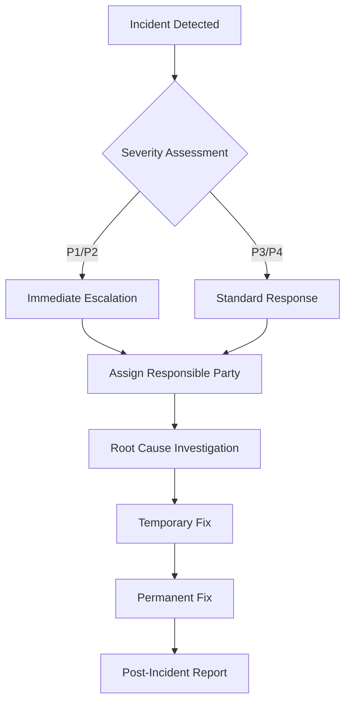

# Operations Requirements Definition

| Item | Details |
|------|---------|
| Project Name | |
| Created | |
| Author | |

---

## 1. Training

### 1.1 Target Audience and Training Plan

| Target Audience | Training Content | Delivery Method | Timing | Instructor |
|----------------|-----------------|----------------|--------|------------|
| End users | Basic system operations | Group training / Manual distribution | Before release | |
| Administrators | Admin features & access management | Individual training | Before release | |
| Operations staff | Operations procedures & incident response | OJT | Before and after release | |

### 1.2 Training Materials

| Material Name | Target Audience | Storage Location |
|--------------|----------------|-----------------|
| User manual | End users | |
| Administrator manual | Administrators | |
| Operations guide | Operations staff | |

---

## 2. Operations Structure

### 2.1 Operations Organization

<!-- List operations staff and escalation paths -->

| Role | Assignee | Contact | Coverage Hours |
|------|----------|---------|---------------|
| Operations manager | | | |
| User support | | | |
| Infrastructure | | | |
| Development (incidents) | | | |

### 2.2 Operating Hours

| Item | Details |
|------|---------|
| System uptime | Weekdays 9:00–18:00 / 24×365 |
| Support hours | |
| Planned maintenance window | |

### 2.3 Monitoring & Alerts

| Monitoring Item | Method | Alert Condition | Notify |
|----------------|--------|----------------|--------|
| Server availability | | | |
| Response time | | Exceeds ○ seconds | |
| Error logs | | | |
| Disk usage | | Exceeds 80% | |

### 2.4 Backup

| Target | Backup Method | Frequency | Retention Period | Storage Location |
|--------|--------------|-----------|-----------------|-----------------|
| Database | Full backup | Daily | 30 days | |
| File storage | | | | |
| Logs | | | | |

### 2.5 Scheduled Tasks

| Task | Frequency | Assignee | Procedure Doc |
|------|-----------|----------|--------------|
| Backup verification | Weekly | | |
| Log rotation | Monthly | | |
| Security patch application | Monthly / as needed | | |
| Performance review | Monthly | | |

---

## 3. Maintenance

### 3.1 Maintenance Scope

| Maintenance Type | Content | Responsible Party |
|-----------------|---------|------------------|
| Corrective maintenance | Bug fixes, emergency response | |
| Preventive maintenance | Version upgrades, patch application | |
| Adaptive maintenance | OS and middleware change response | |
| Perfective maintenance | Feature improvements and additions | |

### 3.2 SLA (Service Level Agreement)

| Item | Target |
|------|--------|
| System availability | 99.9% |
| Time from incident detection to notification | Within ○ hours |
| Recovery Time Objective (RTO) | |
| Recovery Point Objective (RPO) | |
| P1 (Critical) incident response start | Within ○ hours |

### 3.3 Incident Response Flow

### 3.4 Change Management

| Item | Procedure |
|------|-----------|
| Change request | Assignee submits a change request form |
| Impact assessment | Review by development and operations staff |
| Approval | Work proceeds after manager approval |
| Implementation & verification | Operational check and approval after work |
| Record | Log in the change history |

---

## Document Revision History

| Version | Date | Author | Description |
|---------|------|--------|-------------|
| 1.0 | | | Initial version |
