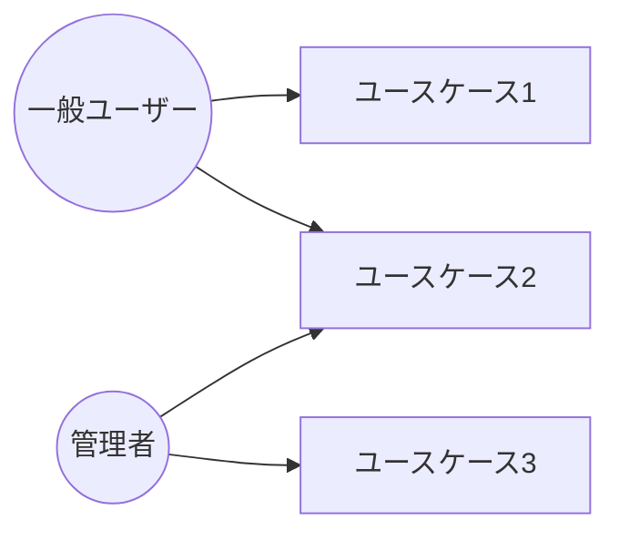

# 要件定義書（PRD）

> **アジャイルでの使い方：** スプリント0（1〜2週間）で「1〜4章」のみ作成し、詳細な機能仕様はスプリントバックログで管理する。スプリントが進むにつれて随時更新する。

| 項目 | 内容 |
|------|------|
| プロジェクト名 | |
| バージョン | |
| 作成日 | |
| 作成者 | |
| 承認者 | |

---

## 1. 背景・目的

<!-- このシステムを作る背景とビジネス上の目的を記載 -->

## 2. ビジネス目標

<!-- 達成したいゴールをKPI・指標で記載 -->

- 目標1:
- 目標2:

## 3. スコープ

### 対象（In Scope）

- 

### 対象外（Out of Scope）

- 

## 4. ステークホルダー

| 役割 | 氏名 | 責任 |
|------|------|------|
| プロジェクトオーナー | | |
| 開発リード | | |
| 顧客担当者 | | |

## 5. ユーザーストーリー

### 5.1 ユーザー（アクター）一覧

| アクターID | アクター名 | 説明 |
|----------|---------|------|
| A-01 | | |
| A-02 | | |

### 5.2 ユースケース一覧

<!-- 大まかな機能単位でユースケースを列挙する。詳細シナリオはSRS 1.2に記載 -->

| No | ユースケース名 | 主アクター | 概要 | 優先度 |
|----|-------------|---------|------|--------|
| UC-01 | | | | 高/中/低 |
| UC-02 | | | | 高/中/低 |

### 5.3 ユーザーストーリー

| No | As a | I want to | So that | 優先度 |
|----|------|-----------|---------|--------|
| 1 | | | | Must |
| 2 | | | | Should |

## 6. 規模・スケジュール

### システム規模

| 項目 | 内容 |
|------|------|
| 想定ユーザー数 | |
| データ量 | |
| 対象拠点・組織 | |

### 時期・時間

| マイルストーン | 予定日 | 備考 |
|--------------|--------|------|
| 要件定義完了 | | |
| 設計完了 | | |
| 開発完了 | | |
| テスト完了 | | |
| リリース（本番稼働） | | |

## 7. 定義（用語集）

<!-- このドキュメントで使用する用語を定義してください -->

| 用語 | 定義 |
|------|------|
| | |

## 8. 制約条件・前提

- 
- 

## 9. 承認

| 役割 | 氏名 | 署名 | 日付 |
|------|------|------|------|
| | | | |

---

## ドキュメント更新履歴

| バージョン | 日付 | 更新者 | 内容 |
|-----------|------|--------|------|
| 1.0 | | | 初版作成 |
