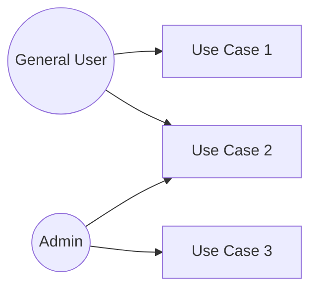

# Requirements Definition Document (PRD)

> **Agile Usage:** During Sprint 0 (1–2 weeks), create only Chapters 1–4. Manage detailed functional specifications in the sprint backlog. Update as sprints progress.
>
> **BMAD Integration:** This PRD is produced by the **Analyst + PM personas** from the Project Brief (`project-brief.md`).
> Epic structure (Section 5.3) is the bridge between the Project Brief and individual Story files (`stories/*.md`).
> Keep the Epic list here in sync with `project-brief.md` Section 7.

| Item | Content |
|------|---------|
| Project Name | |
| Version | |
| Created Date | |
| Author | |
| Approver | |

---

## 1. Background & Purpose

<!-- Describe the background for building this system and the business objectives -->

## 2. Business Goals

<!-- Describe goals to achieve using KPIs and metrics -->

- Goal 1:
- Goal 2:

## 3. Scope

### In Scope

- 

### Out of Scope

- 

## 4. Stakeholders

| Role | Name | Responsibility |
|------|------|---------------|
| Project Owner | | |
| Development Lead | | |
| Customer Representative | | |

## 5. User Stories

### 5.1 Actor List

| Actor ID | Actor Name | Description |
|----------|-----------|------------|
| A-01 | | |
| A-02 | | |

### 5.2 Use Case List

<!-- List use cases at a high feature level. Detailed scenarios are described in SRS 1.2 -->

| No | Use Case Name | Primary Actor | Overview | Priority |
|----|--------------|--------------|---------|---------|
| UC-01 | | | | High/Medium/Low |
| UC-02 | | | | High/Medium/Low |

### 5.3 Epics & Story Map

> Epics are high-level capability groupings. Each Epic contains one or more User Stories.
> Epic IDs here correspond to the Project Brief (`project-brief.md` Section 7) and to
> individual story files (`stories/EP-XX-US-YYY-*.md`).
>
> **BMAD Persona Lead**: the AI persona responsible for elaborating stories in each Epic.

| Epic ID | Epic Name | Description | BMAD Persona Lead | Story Count | Priority |
|---------|-----------|------------|-------------------|-------------|---------|
| EP-01 | | | PM / Analyst | | Must |
| EP-02 | | | Architect | | Must |
| EP-03 | | | Developer | | Should |

#### Story Map (Epic → Story)

| Epic ID | Story ID | Story Title | SP | Status |
|---------|----------|------------|-----|--------|
| EP-01 | US-001 | | | Not Started |
| EP-01 | US-002 | | | Not Started |
| EP-02 | US-003 | | | Not Started |

### 5.4 User Stories

| No | As a | I want to | So that | Epic | Priority |
|----|------|-----------|---------|------|---------|
| 1 | | | | EP-01 | Must |
| 2 | | | | EP-01 | Should |

## 6. Scale & Schedule

### System Scale

| Item | Content |
|------|---------|
| Expected Users | |
| Data Volume | |
| Target Sites / Organizations | |

### Timeline

| Milestone | Planned Date | Notes |
|----------|------------|-------|
| Requirements Definition Complete | | |
| Design Complete | | |
| Development Complete | | |
| Testing Complete | | |
| Release (Go-live) | | |

## 7. Definitions (Glossary)

<!-- Define terms used in this document -->

| Term | Definition |
|------|-----------|
| | |

## 8. Constraints & Assumptions

- 
- 

## 9. Approval

| Role | Name | Signature | Date |
|------|------|-----------|------|
| | | | |

---

## Document History

| Version | Date | Author | Content |
|---------|------|--------|---------|
| 1.0 | | | Initial version |
