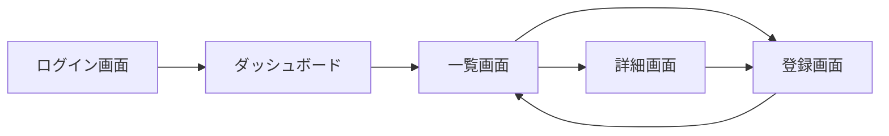

# 画面設計書

| 項目 | 内容 |
|------|------|
| プロジェクト名 | |
| 作成日 | |
| 作成者 | |
| 承認者 | |
| Figmaファイル | [Figmaで開く](https://www.figma.com/file/XXXX) |

---

## 1. 画面一覧

| No | 画面ID | 画面名 | 説明 | 対象ユーザー | Figmaフレーム |
|----|--------|--------|------|------------|-------------|
| 1 | SCR-001 | ログイン画面 | | 全ユーザー | [Figma](https://www.figma.com/file/XXXX?node-id=001) |
| 2 | SCR-002 | ダッシュボード | | 全ユーザー | [Figma](https://www.figma.com/file/XXXX?node-id=002) |
| 3 | SCR-003 | 〇〇一覧画面 | | | [Figma](https://www.figma.com/file/XXXX?node-id=003) |
| 4 | SCR-004 | 〇〇詳細画面 | | | [Figma](https://www.figma.com/file/XXXX?node-id=004) |
| 5 | SCR-005 | 〇〇登録画面 | | | [Figma](https://www.figma.com/file/XXXX?node-id=005) |

> Figmaフレームのnode-idはFigmaでフレームを選択した時のURLから取得してください。

---

## 2. 画面遷移図

---

## 3. レスポンシブ対応方針

| ブレークポイント | 幅 | レイアウト |
|--------------|-----|---------|
| モバイル | ～ 767px | 1カラム・ハンバーガーメニュー |
| タブレット | 768px ～ 1023px | 2カラム・サイドバー折りたたみ |
| デスクトップ | 1024px ～ | フルレイアウト |

> 対応デバイスの詳細は SRS 2.1 ユーザービリティ要件を参照。

---

## 4. 共通UI仕様

### ローディング状態

| 対象 | 表示方法 | 備考 |
|------|---------|------|
| ページ全体読み込み | 画面中央スピナー | 背景をオーバーレイ |
| ボタン押下後の処理 | ボタン内スピナー + 非活性化 | 二重送信防止 |
| テーブル・リスト更新 | スケルトンスクリーン | 既存データを隠さない |

### 0件（Empty）状態

| 対象 | 表示内容 |
|------|---------|
| 検索結果なし | 「該当するデータが見つかりません」＋検索条件クリアボタン |
| データ未登録 | 「まだデータがありません」＋登録ボタン |

### エラー状態

| 種類 | 表示方法 | 例 |
|------|---------|-----|
| フォーム入力エラー | 項目直下に赤文字 | 「〇〇は必須です」 |
| API通信エラー | フォーム上部にトーストまたはバナー | 「保存に失敗しました。再度お試しください」 |
| 権限エラー | 専用エラーページへ遷移 | 403 画面 |
| システムエラー | 専用エラーページへ遷移 | 500 画面 |

---

## 5. 画面詳細

> **方針：** レイアウト・ビジュアルデザインはFigmaで管理します。
> この設計書では入力仕様・バリデーション・エラーメッセージなど、
> Figmaだけでは表現しきれない**動作仕様**を定義します。

---

### SCR-001: ログイン画面

**概要：** システムへのログイン

**Figmaデザイン：** [SCR-001 ログイン画面](https://www.figma.com/file/XXXX?node-id=001)

**入力項目**

| No | 項目名 | 型 | 必須 | バリデーション |
|----|--------|-----|------|--------------|
| 1 | メールアドレス | text | 必須 | メール形式 |
| 2 | パスワード | password | 必須 | 8文字以上 |

**ボタン・アクション**

| ボタン名 | アクション | 遷移先 |
|---------|-----------|--------|
| ログイン | 認証処理を実行 | 成功：ダッシュボード / 失敗：エラー表示 |
| パスワードを忘れた方はこちら | パスワードリセット画面へ遷移 | SCR-006 |

**エラーメッセージ**

| 条件 | メッセージ | 表示箇所 |
|------|----------|---------|
| メールアドレス未入力 | 「メールアドレスは必須です」 | 項目直下 |
| パスワード未入力 | 「パスワードは必須です」 | 項目直下 |
| 認証失敗 | 「メールアドレスまたはパスワードが正しくありません」 | フォーム上部 |
| アカウントロック | 「アカウントがロックされています。管理者にお問い合わせください」 | フォーム上部 |

**状態定義**

| 状態 | 説明 |
|------|------|
| 初期表示 | 入力欄は空、ログインボタンは活性 |
| 入力中 | リアルタイムバリデーションは行わない |
| 送信中 | ローディングスピナーを表示、ボタンを非活性化 |
| エラー | エラーメッセージを表示、入力欄はクリアしない |

---

### SCR-003: 〇〇一覧画面

**概要：** 〇〇の一覧表示・検索

**Figmaデザイン：** [SCR-003 〇〇一覧画面](https://www.figma.com/file/XXXX?node-id=003)

**検索条件**

| No | 項目名 | 型 | 必須 | 説明 |
|----|--------|-----|------|------|
| 1 | 名前 | text | 任意 | 部分一致・大文字小文字を区別しない |

**表示項目**

| No | カラム名 | 説明 | ソート | 初期ソート |
|----|---------|------|--------|----------|
| 1 | ID | | 可 | - |
| 2 | 名前 | | 可 | 昇順（初期） |
| 3 | 状態 | | 不可 | - |
| 4 | 操作 | 編集・削除ボタン | - | - |

**ページネーション**

| 項目 | 仕様 |
|------|------|
| 1ページの表示件数 | 20件 |
| 0件時の表示 | 「該当するデータが見つかりません」 |

**ボタン・アクション**

| ボタン名 | アクション | 遷移先 |
|---------|-----------|--------|
| 新規登録 | 登録画面へ遷移 | SCR-005 |
| 検索 | 検索条件でデータを絞り込む | - |
| 編集 | 対象データの編集画面へ遷移 | SCR-005 |
| 削除 | 確認ダイアログを表示 | - |

**削除確認ダイアログ**

| 項目 | 内容 |
|------|------|
| メッセージ | 「〇〇を削除します。この操作は取り消せません。よろしいですか？」 |
| ボタン | 「削除する」（赤） / 「キャンセル」 |

---

### SCR-005: 〇〇登録・編集画面

**概要：** 〇〇の新規登録および既存データの編集

**Figmaデザイン：** [SCR-005 〇〇登録・編集画面](https://www.figma.com/file/XXXX?node-id=005)

**入力項目**

| No | 項目名 | 型 | 必須 | バリデーション | 備考 |
|----|--------|-----|------|--------------|------|
| 1 | 〇〇名 | text | 必須 | 最大50文字 | |
| 2 | 〇〇区分 | select | 必須 | 選択肢から選ぶ | マスタから取得 |
| 3 | 備考 | textarea | 任意 | 最大200文字 | |

**ボタン・アクション**

| ボタン名 | アクション | 遷移先 |
|---------|-----------|--------|
| 登録 / 更新 | バリデーション後に保存処理 | 成功：一覧画面（完了メッセージ表示） |
| キャンセル | 入力内容を破棄して戻る | 一覧画面 |

**エラーメッセージ**

| 条件 | メッセージ | 表示箇所 |
|------|----------|---------|
| 必須項目未入力 | 「〇〇は必須です」 | 項目直下 |
| 文字数超過 | 「〇〇は〇〇文字以内で入力してください」 | 項目直下 |
| 保存失敗 | 「保存に失敗しました。再度お試しください」 | フォーム上部 |

---

## 承認

| 役割 | 氏名 | 署名 | 日付 |
|------|------|------|------|
| プロジェクトオーナー | | | |
| 開発リード | | | |

---

## ドキュメント更新履歴

| バージョン | 日付 | 更新者 | 内容 |
|-----------|------|--------|------|
| 1.0 | | | 初版作成 |
