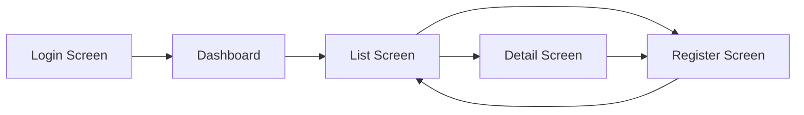

# Screen Design Document

| Item | Content |
|------|---------|
| Project Name | |
| Created Date | |
| Author | |
| Approver | |
| Figma File | [Open in Figma](https://www.figma.com/file/XXXX) |

---

## 1. Screen List

| No | Screen ID | Screen Name | Description | Target Users | Figma Frame |
|----|-----------|------------|-------------|--------------|-------------|
| 1 | SCR-001 | Login Screen | | All users | [Figma](https://www.figma.com/file/XXXX?node-id=001) |
| 2 | SCR-002 | Dashboard | | All users | [Figma](https://www.figma.com/file/XXXX?node-id=002) |
| 3 | SCR-003 | ○○ List Screen | | | [Figma](https://www.figma.com/file/XXXX?node-id=003) |
| 4 | SCR-004 | ○○ Detail Screen | | | [Figma](https://www.figma.com/file/XXXX?node-id=004) |
| 5 | SCR-005 | ○○ Registration Screen | | | [Figma](https://www.figma.com/file/XXXX?node-id=005) |

> Get Figma frame node-ids from the URL when selecting a frame in Figma.

---

## 2. Screen Transition Diagram

---

## 3. Responsive Design Policy

| Breakpoint | Width | Layout |
|-----------|-------|--------|
| Mobile | ～ 767px | Single column · Hamburger menu |
| Tablet | 768px ～ 1023px | 2 columns · Collapsible sidebar |
| Desktop | 1024px ～ | Full layout |

> For detailed supported devices, refer to SRS Section 2.1 Usability Requirements.

---

## 4. Common UI Specifications

### Loading States

| Target | Display Method | Notes |
|--------|--------------|-------|
| Full page loading | Center spinner with overlay background | |
| After button press | Spinner inside button + disabled state | Prevent double submission |
| Table/list update | Skeleton screen | Does not hide existing data |

### Empty States

| Target | Display Content |
|--------|----------------|
| No search results | "No matching data found" + Clear search conditions button |
| No data registered | "No data yet" + Register button |

### Error States

| Type | Display Method | Example |
|------|--------------|---------|
| Form input error | Red text below the field | "○○ is required" |
| API communication error | Toast or banner above the form | "Failed to save. Please try again." |
| Permission error | Redirect to dedicated error page | 403 screen |
| System error | Redirect to dedicated error page | 500 screen |

---

## 5. Screen Details

> **Policy:** Layout and visual design are managed in Figma.
> This document defines **behavioral specifications** that cannot be fully expressed in Figma alone,
> such as input specifications, validation rules, and error messages.

---

### SCR-001: Login Screen

**Overview:** System login

**Figma Design:** [SCR-001 Login Screen](https://www.figma.com/file/XXXX?node-id=001)

**Input Fields**

| No | Field Name | Type | Required | Validation |
|----|-----------|------|----------|-----------|
| 1 | Email Address | text | Required | Email format |
| 2 | Password | password | Required | 8 characters or more |

**Buttons & Actions**

| Button Name | Action | Destination |
|------------|--------|------------|
| Login | Execute authentication | Success: Dashboard / Failure: Show error |
| Forgot your password? | Navigate to password reset screen | SCR-006 |

**Error Messages**

| Condition | Message | Display Location |
|-----------|---------|-----------------|
| Email address not entered | "Email address is required" | Below field |
| Password not entered | "Password is required" | Below field |
| Authentication failure | "Email address or password is incorrect" | Above form |
| Account locked | "Your account is locked. Please contact the administrator." | Above form |

**State Definitions**

| State | Description |
|-------|------------|
| Initial display | Input fields are empty, Login button is enabled |
| Entering | No real-time validation |
| Submitting | Show loading spinner, disable button |
| Error | Show error message, do not clear input fields |

---

### SCR-003: ○○ List Screen

**Overview:** Display and search ○○ list

**Figma Design:** [SCR-003 ○○ List Screen](https://www.figma.com/file/XXXX?node-id=003)

**Search Conditions**

| No | Field Name | Type | Required | Description |
|----|-----------|------|----------|------------|
| 1 | Name | text | Optional | Partial match · Case-insensitive |

**Display Items**

| No | Column Name | Description | Sortable | Default Sort |
|----|------------|-------------|---------|-------------|
| 1 | ID | | Yes | - |
| 2 | Name | | Yes | Ascending (default) |
| 3 | Status | | No | - |
| 4 | Actions | Edit/Delete buttons | - | - |

**Pagination**

| Item | Specification |
|------|--------------|
| Records per page | 20 |
| Display when 0 records | "No matching data found" |

**Buttons & Actions**

| Button Name | Action | Destination |
|------------|--------|------------|
| New Registration | Navigate to registration screen | SCR-005 |
| Search | Filter data by search conditions | - |
| Edit | Navigate to edit screen for target data | SCR-005 |
| Delete | Show confirmation dialog | - |

**Delete Confirmation Dialog**

| Item | Content |
|------|---------|
| Message | "Delete ○○. This operation cannot be undone. Are you sure?" |
| Buttons | "Delete" (red) / "Cancel" |

---

### SCR-005: ○○ Registration / Edit Screen

**Overview:** Register new ○○ or edit existing data

**Figma Design:** [SCR-005 ○○ Registration/Edit Screen](https://www.figma.com/file/XXXX?node-id=005)

**Input Fields**

| No | Field Name | Type | Required | Validation | Notes |
|----|-----------|------|----------|-----------|-------|
| 1 | ○○ Name | text | Required | Max 50 characters | |
| 2 | ○○ Category | select | Required | Select from options | Retrieved from master data |
| 3 | Remarks | textarea | Optional | Max 200 characters | |

**Buttons & Actions**

| Button Name | Action | Destination |
|------------|--------|------------|
| Register / Update | Validate then save | Success: List screen (show completion message) |
| Cancel | Discard input and go back | List screen |

**Error Messages**

| Condition | Message | Display Location |
|-----------|---------|-----------------|
| Required field not entered | "○○ is required" | Below field |
| Character limit exceeded | "○○ must be ○○ characters or less" | Below field |
| Save failed | "Failed to save. Please try again." | Above form |

---

## Approval

| Role | Name | Signature | Date |
|------|------|-----------|------|
| Project Owner | | | |
| Development Lead | | | |

---

## Document History

| Version | Date | Author | Content |
|---------|------|--------|---------|
| 1.0 | | | Initial version |
