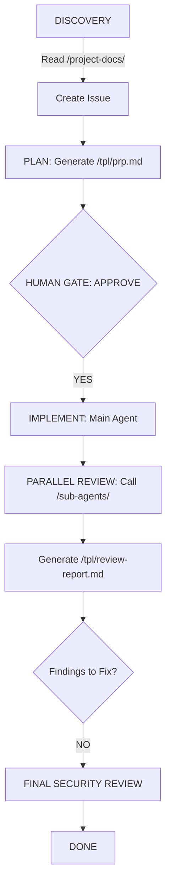

# Unified AI-Dev & Agentic Workflow

```mermaid
flowchart TD
    A[DISCOVERY] --> |Read /project-docs/| B[Create Issue]
    B --> C[PLAN: Generate /tpl/prp.md]
    C --> D{HUMAN GATE: APPROVE}
    D -- YES --> E[IMPLEMENT: Main Agent]
    E --> F[PARALLEL REVIEW: Call /sub-agents/]
    F --> G[Generate /tpl/review-report.md]
    G --> H{Findings to Fix?}
    H -- NO --> I[FINAL SECURITY REVIEW]
    I --> J[DONE]
```
