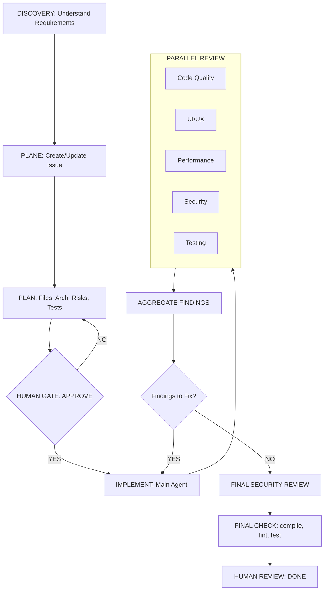

# 🤖 AI Agentic Workflow Boilerplate

A standardized, multi-agent workflow architecture for AI-assisted coding (Codex, Claude, Cursor, Aider). This script instantly scaffolds a highly disciplined `.codex/` release `.claude` for claude environment into any project, enforcing a strict Human-in-the-loop and Parallel Review process.

please run
```
bash <(curl -sL https://raw.githubusercontent.com/Juman8/ai-workflow/main/init-ai-workflow)
```
## 🌟 Why this Workflow?

When working with Autonomous Coding Agents, giving them unrestricted access can lead to chaotic commits and architectural drift. This workflow solves that by dividing AI into "departments":
- **Main Agent**: Plans and implements features.
- **Review Agents**: Specialized agents (UI/UX, Security, Performance, Code Quality) that run in parallel and *only* read code.
- **Human Gate**: AI cannot modify code without explicit human approval of the plan.

## 🏗 Workflow Architecture


1. tpl/ (Templates)
   
Tác dụng: Là trái tim của hệ thống tài liệu. Nó chứa toàn bộ các Biểu mẫu mẫu cho vòng đời phát triển phần mềm.
Bao gồm: Mẫu viết yêu cầu (prd.md), mẫu thiết kế DB (db-design.md), mẫu giao việc cho AI (prp.md), mẫu viết test.
Tại sao cần: Để mọi project và mọi team trong công ty khi viết tài liệu đều dùng chung một định dạng, giúp AI (và con người) đọc hiểu đồng nhất.

3. ci/ (Continuous Integration)
   
Tác dụng: Chứa các kịch bản chạy tự động (CI/CD pipelines) như GitHub Actions hoặc GitLab CI.
Tại sao cần: Trong tài liệu project-structure.md của ai-dev có nhắc đến việc đồng bộ tài liệu đa thư mục (Multi-repo sync). Thư mục ci/ chứa các lệnh để tự động copy file API Spec từ repo tài liệu sang các repo code (Frontend, Mobile) mỗi khi có sự thay đổi.

4. scripts/ (Automation Scripts)
   
Tác dụng: Chứa các đoạn code tiện ích (bash, python, js) để tự động hóa các thao tác lặp đi lặp lại.
Bao gồm: Các script để tạo mới dự án, script tính toán Metrics (đo lường hiệu suất của AI), hoặc script dọn dẹp file rác.

5. harness/ (Test / Eval Harness)
   
Tác dụng: Chứa các công cụ hoặc môi trường giả lập dùng để Kiểm thử và Đo lường AI.
Tại sao cần: "Harness" trong kỹ thuật phần mềm là "bộ đai kẹp/khung kiểm thử". Trong ngữ cảnh AI, nó thường dùng để chứa các bộ test tự động nhằm đánh giá xem: Prompt này đưa cho AI thì tỷ lệ code đúng là bao nhiêu phần trăm? (AI Evaluation). Nó dùng để chấm điểm độ hiệu quả của Agent.

6. wip/ (Work In Progress)

Tác dụng: Thư mục "Đang thi công" (Nháp).
Tại sao cần: Chứa các tài liệu, tính năng, hoặc rule mới đang được team viết dở dang, chưa chốt để áp dụng chính thức cho toàn công ty. Các Agent thường được cấu hình để bỏ qua (ignore) không đọc thư mục này để tránh bị loạn thông tin bởi các luật chưa hoàn thiện.
